# StudVerse Chat Application - Activity Diagrams

## Overview
This document contains activity diagrams that illustrate the main workflows and system interactions in the StudVerse chat application. These diagrams show the flow of activities from user actions to system responses.

## 1. User Authentication Flow

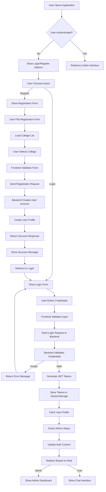

## 2. Real-time Messaging Flow

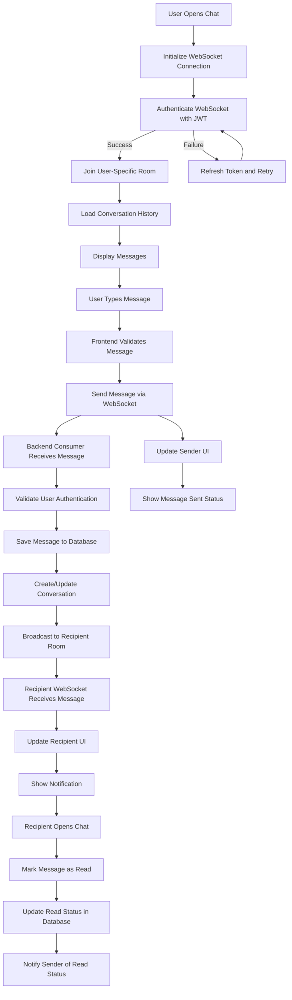

## 3. Group Creation and Management Flow

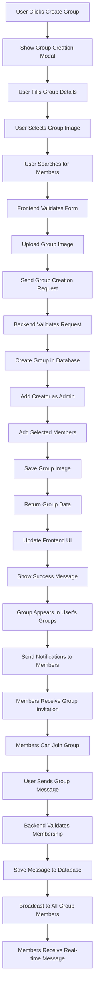

## 4. File Upload and Sharing Flow

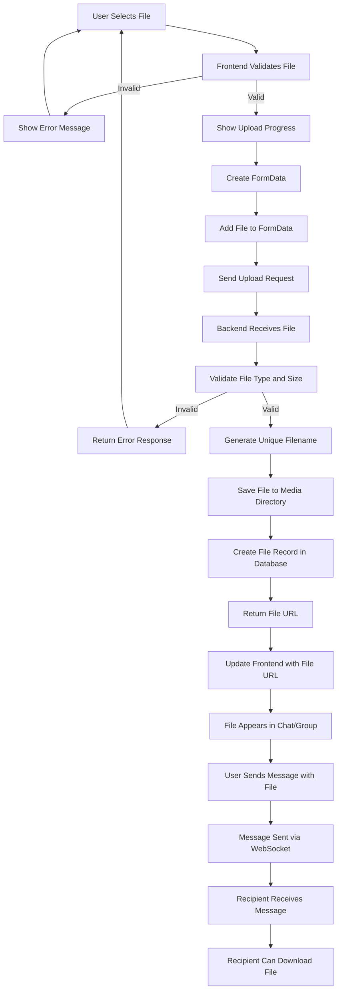

## 5. Profile Management Flow

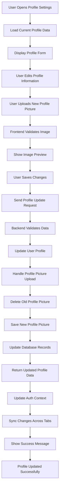

## 6. Admin Panel Workflow

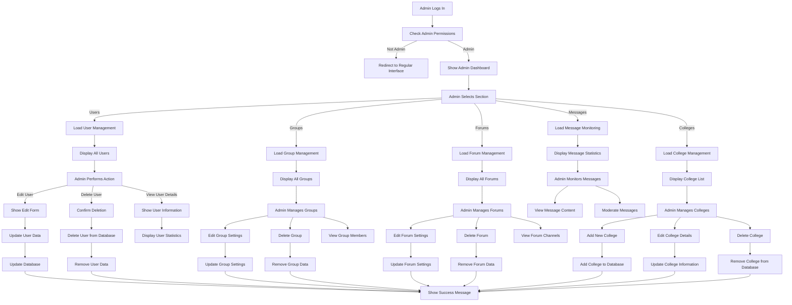

## 7. Multi-tab Session Management Flow

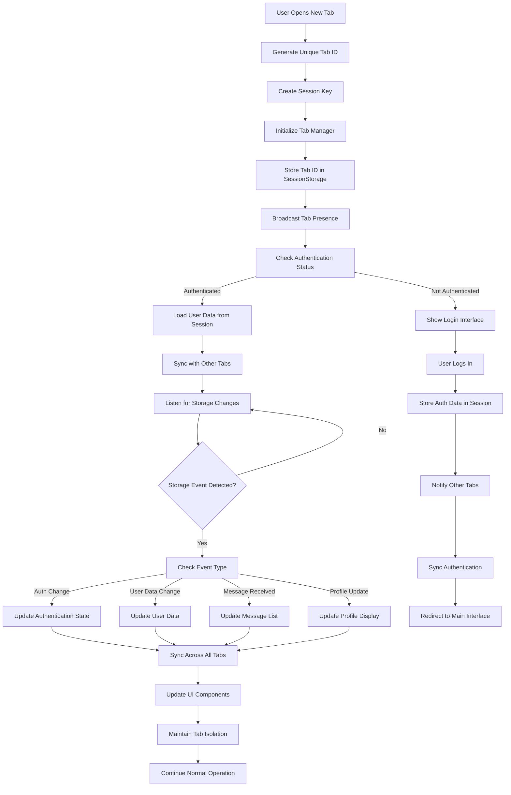

## 8. Forum and Channel Management Flow

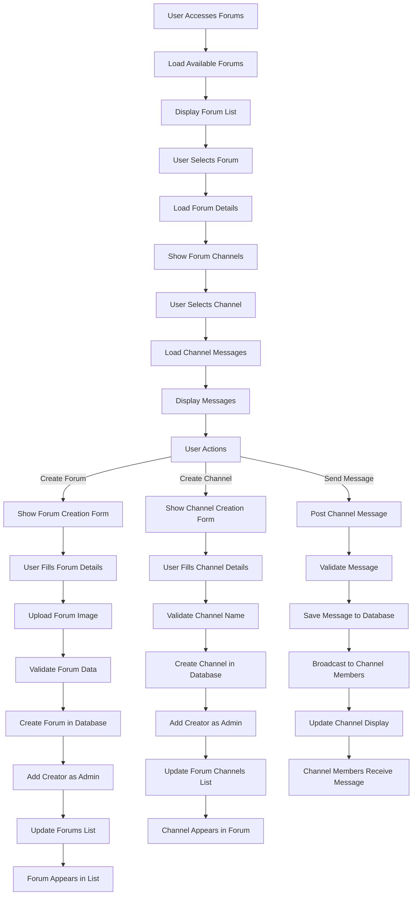

## 9. Location Services Flow

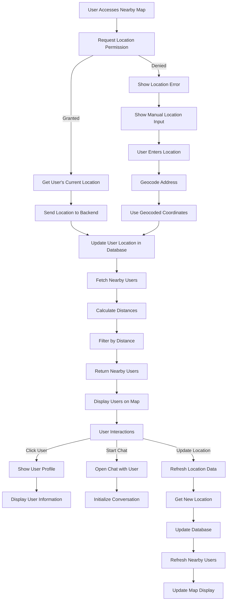

## 10. Error Handling and Recovery Flow

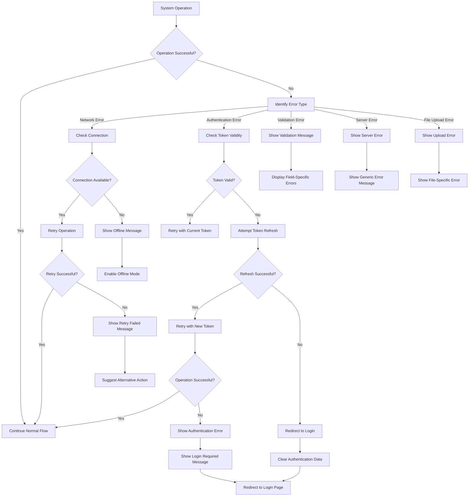

## 11. System Startup and Initialization Flow

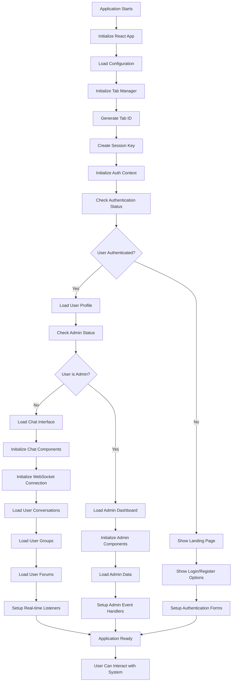

## 12. Data Synchronization Flow

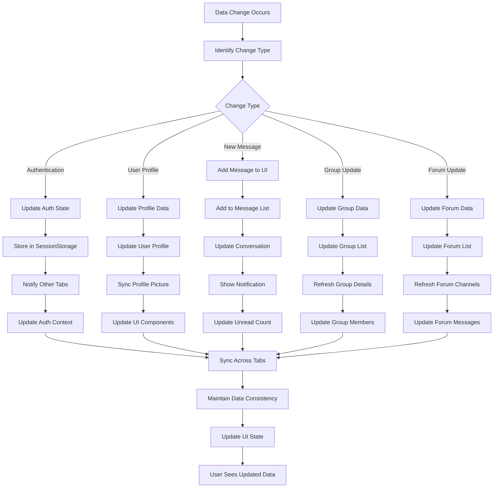

These activity diagrams provide a comprehensive view of how the StudVerse chat application system works, showing the flow of activities from user interactions to system responses. Each diagram focuses on a specific aspect of the system, making it easier to understand the complex interactions between different components.
