# StudVerse Chat Application - State Diagrams

## Overview
This document contains state diagrams that illustrate the different states and transitions in the StudVerse chat application system.

## 1. User Authentication State Diagram

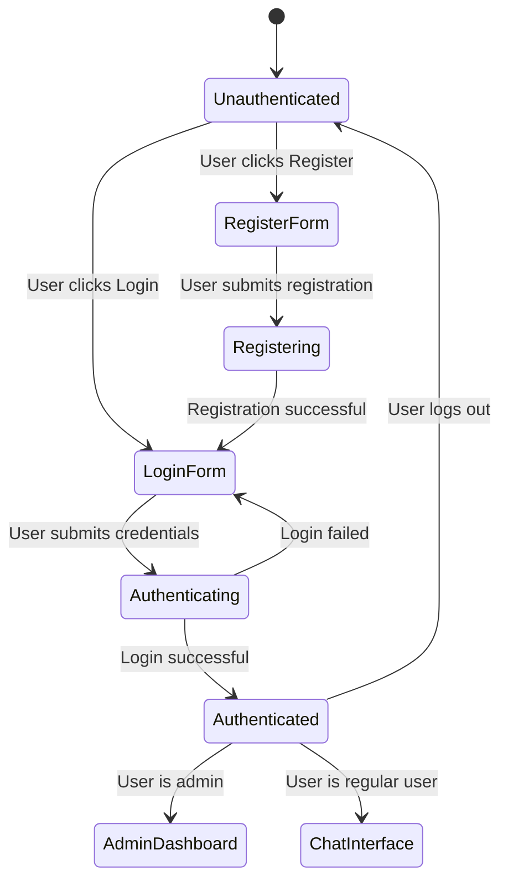

## 2. Chat Interface State Diagram

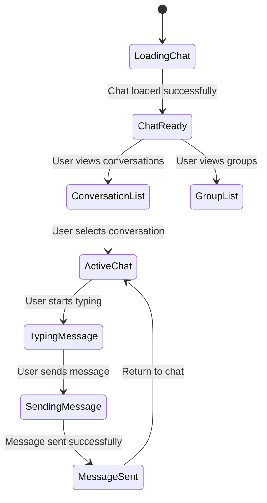

## 3. WebSocket Connection State Diagram

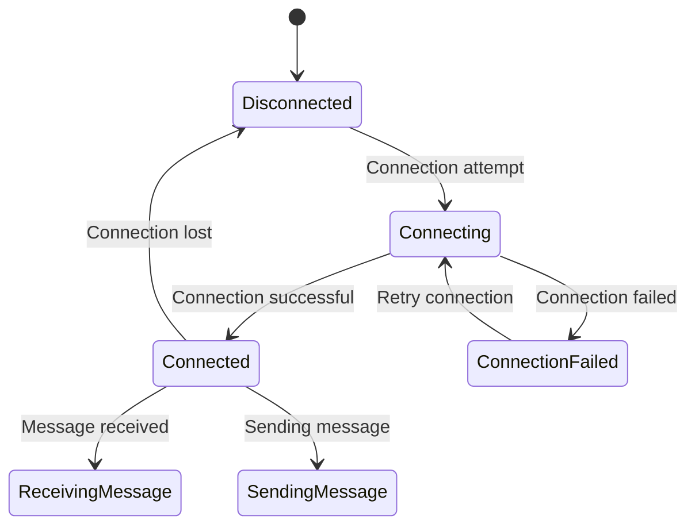

## 4. File Upload State Diagram

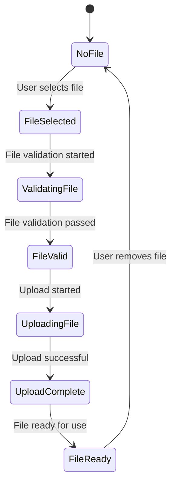

## 5. Group Management State Diagram

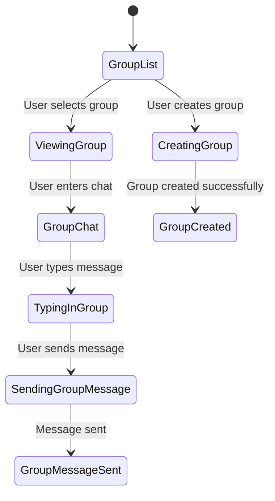

## 6. Admin Panel State Diagram

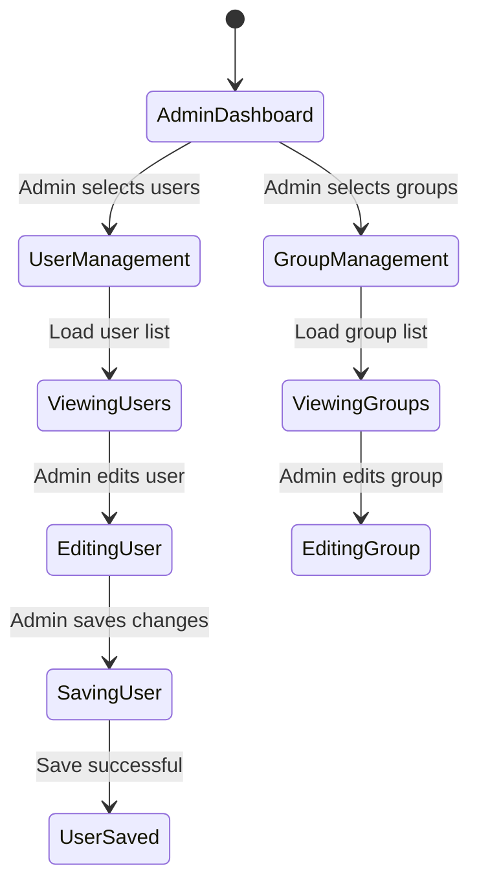

## 7. Multi-tab Session State Diagram

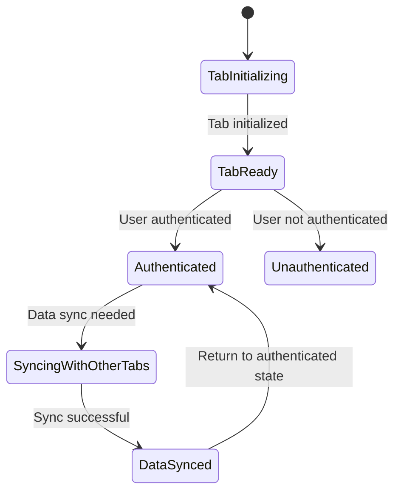

## 8. Error Handling State Diagram

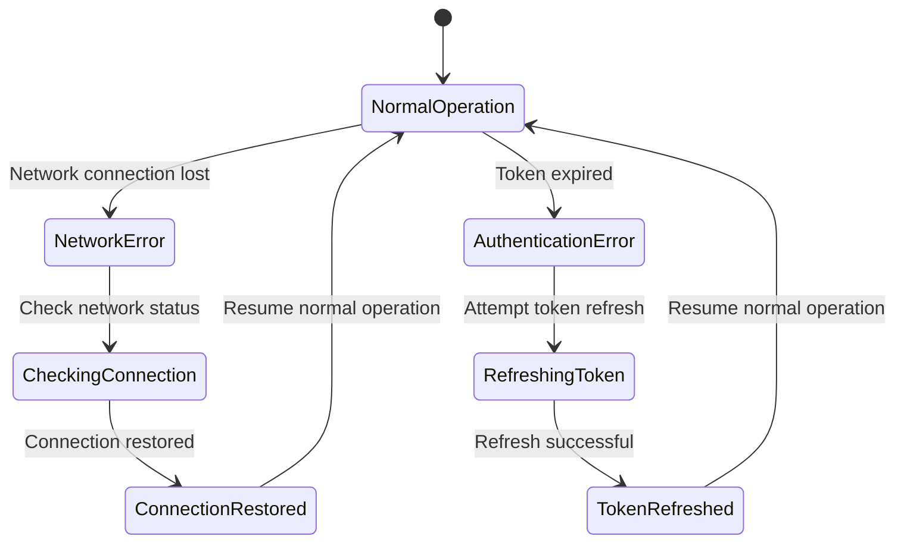

## 9. System Initialization State Diagram

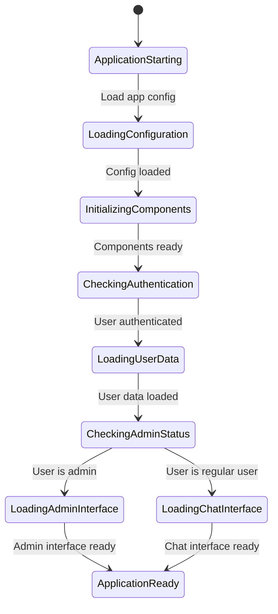

## 10. Profile Management State Diagram

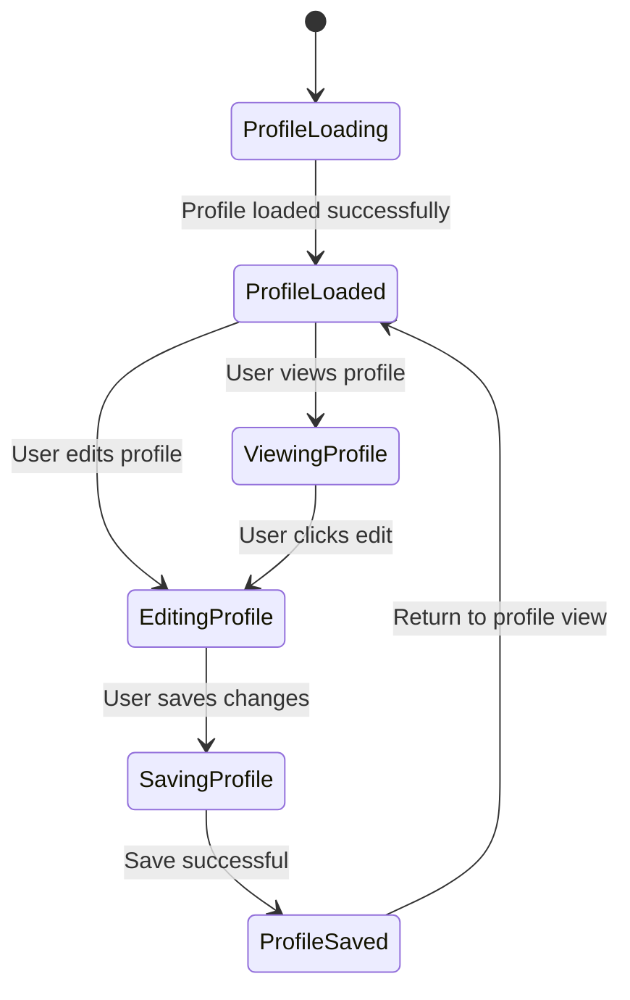

## 11. Forum Management State Diagram

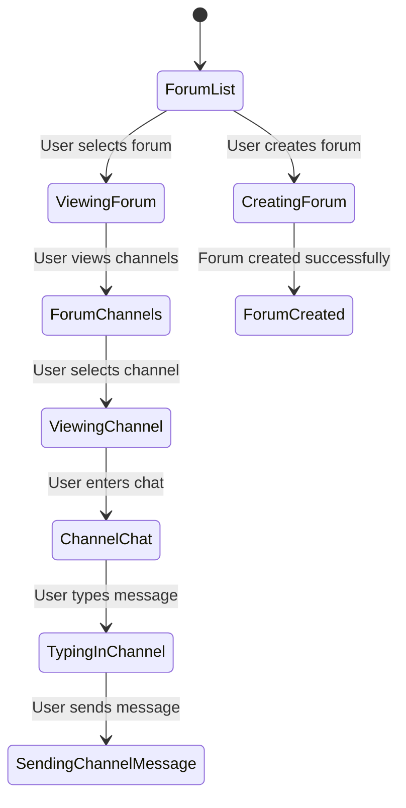

## 12. Location Services State Diagram

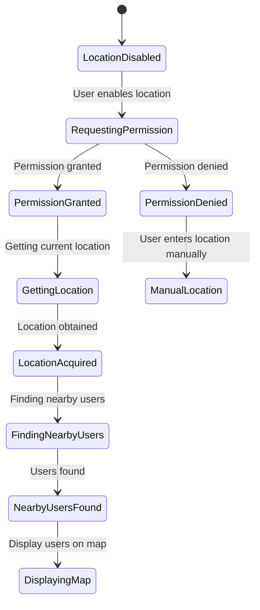

These state diagrams provide a comprehensive view of how the StudVerse chat application system transitions between different states based on user actions, system events, and external conditions. Each diagram focuses on a specific aspect of the system, showing the various states and the conditions that trigger transitions between them.
